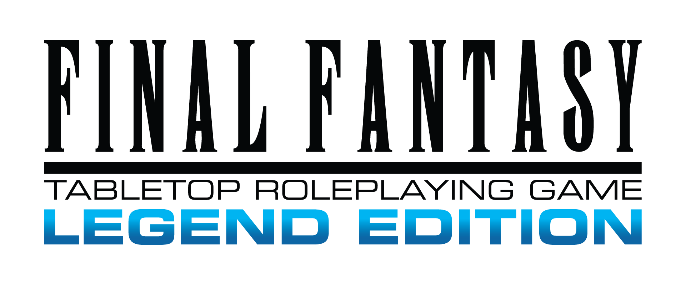

# Final Fantasy TRPG: Legend Edition — Foundry VTT system

An unofficial Foundry VTT game system for **Final Fantasy TRPG: Legend Edition**. It includes character sheets, guided character creation, a Codex, a Bestiary, equipment tools, and automated rolls and effects.

This repository holds the system's releases. Each [release](https://github.com/VisCorpRS/ffle-releases/releases) lists what changed.

## Installation

Requires **Foundry VTT v14**.

In Foundry, go to **Game Systems → Install System** and paste this manifest URL at the bottom:

```
https://github.com/VisCorpRS/ffle-releases/releases/latest/download/system.json
```

Foundry will offer an **Update** whenever a new version is released.

To install by hand instead, download `final-fantasy-legends-edition.zip` from the [latest release](https://github.com/VisCorpRS/ffle-releases/releases/latest) and extract it into Foundry's `Data/systems/final-fantasy-legends-edition` folder. Restart Foundry and pick the system when creating or configuring a world.

**Compatibility**

This system includes optional animations for certain abilities and spells. To enable them, install the following Foundry VTT modules:

[Sequencer](https://foundryvtt.com/packages/sequencer) — Required for animation playback.

[JB2A – Jules & Ben's Animated Assets](https://foundryvtt.com/packages/JB2A_DnD5e) — Provides the animated assets used by the system.

These modules are entirely optional. The system can be used without them, but the associated animations will not be available.

## Credits and attribution

**Foundry implementation**

Vissia — Project Lead / Developer. Oversaw and contributed to the development of this Foundry VTT implementation, including design, rules integration, testing, troubleshooting, and refinement. The project was developed using tool-assisted workflows.

**Underlying game**

Final Fantasy TRPG: Legend Edition was created by Mildra the Monk and Xanatrix Zadare. See the [official game page](https://mildra.itch.io/finalfantasy-le) for the source game, its full credits, and licensing information.

**License**

Final Fantasy TRPG: Legend Edition is licensed by its creators under [CC BY-NC-SA 4.0](https://creativecommons.org/licenses/by-nc-sa/4.0/), and so is this implementation: free to use, share and adapt with attribution, for non-commercial purposes, under the same license.

Final Fantasy and associated characters and trademarks are the property of Square Enix Co., Ltd. This is an unofficial fan-made implementation and is not affiliated with or endorsed by Square Enix.

**Third-Party Modules and Licensing**

Sequencer and JB2A are independent, third-party projects. They are not part of this system, and their respective creators retain ownership of their work. Each is distributed under its own license and is subject to its creators' terms and conditions.

Their inclusion in this README does not imply any ownership, affiliation, or endorsement. Their licenses are separate from the license governing this system, and any use or redistribution of their components is subject to their respective licensing terms.


## About

Thank you for checking out this module!

This project originally began as something I made for a friend's campaign. Over time, I realized it could be useful to others as well, so I decided to share it with the community in the spirit of open source.

This system is free and will always remain free. If you enjoy my work and would like to support my future Foundry projects, feel free to follow me on [GitHub](https://github.com/VisCorpRS), where you can also keep an eye out for other projects.

You're also welcome to take this module, modify it, and build upon it, as long as you respect the terms of the license above.
